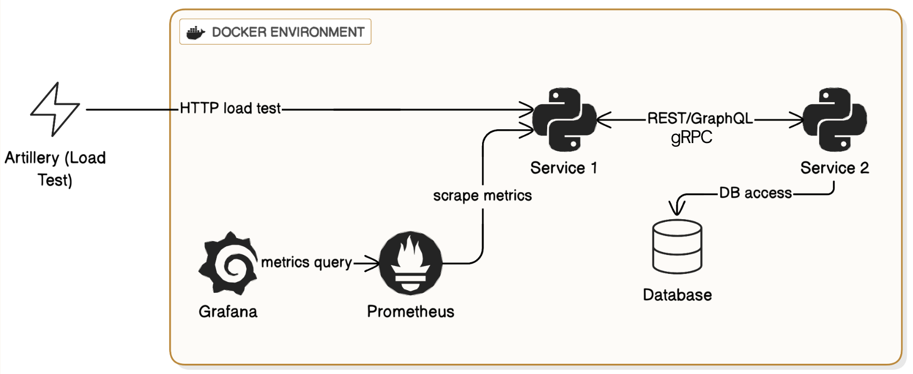

<!-- PROJECT HEADER -->
<h1>
<p align="center">
  
  <br> Microservices
</p>
</h1>

<p align="center">
  A distributed microservices system comparing REST, GraphQL, and gRPC performance.
  <br />
  <a href="#about">About</a>
  ·
  <a href="#requirements">Requirements</a>
  ·
  <a href="#instructions">Instructions</a>
  ·
  <a href="#report">Report</a>
</p>

## About

This project emulates a distributed microservices architecture to compare different communication protocols in non-monolithic systems. The services are fully containerized using **Docker** and orchestrated with **Docker Compose**.

The system consists of two core services — **service-a** and **service-b** — which communicate using three protocols:

- **gRPC**
- **GraphQL**
- **REST**

All HTTP endpoints are implemented with **FastAPI**, and services run on **Uvicorn**.  
A PostgreSQL database provides storage for user data fetched by service-a.

A synthetic client workload is generated through **Artillery**, which sends requests to service-b specifying the desired protocol. Service-b then forwards the request to service-a using that protocol. Service-a queries PostgreSQL and returns the response back to service-b.

The project also integrates **Prometheus** for collecting metrics (e.g., latency, throughput, CPU usage) from service-b, which can be visualized locally with **Grafana**.


## Requirements

This project requires the following installed on your system:

- **Docker** (Project built and tested on Docker `27.5.1`)
- **Python** (Project uses Python `3.13.2`)
- **Node.js** and **npm** (Tested with Node.js `22.14.0` and npm `10.9.2`)

Each microservice has its own Python virtual environment handled internally by Docker, so you do not need to manually activate any venv. Artillery is installed automatically when running `npm install`.

## Instructions

### 1. Install NPM dependencies  
This will install Artillery and other required JS tooling:

```bash
npm install
```

### 2. Build and run the system with Docker

```bash
docker compose build
docker compose up
```

This launches:
- service-a  
- service-b  
- PostgreSQL  
- Prometheus  
- Grafana  

### 3. Configure Artillery

Below is an example configuration for sending mixed REST and GraphQL requests to service-b:

```yaml
config:
  target: "http://localhost:8080"   # Service B endpoint
  phases:
    - duration: 3000               # Run for 3000 seconds
      arrivalRate: 10              # 10 requests/sec
  defaults:
    headers:
      Content-Type: "application/json"

scenarios:
  - name: "Protocol Comparison Test"
    weight: 3
    flow:
      - post:
          url: "/request"
          json:
            protocol: "REST"
            operation: "getUsers"
            payload: {}

      - post:
          url: "/request"
          json:
            protocol: "GraphQL"
            operation: "getUsers"
            payload:
              query: |
                {
                  users {
                    id
                    name
                    email
                  }
                }
```

You can modify the `protocol`, `operation`, and request payload to test any of the supported communication types.

### 4. Start artillery
```bash
npx artillery run tests/load/artillery.yaml
```

## Report

For detailed analysis, methodology, performance metrics, and results, please refer to the **project report**, included in the repository. 
📄 **[Project Report (PDF)](docs/report.pdf)**